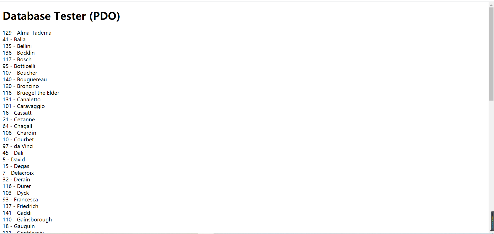
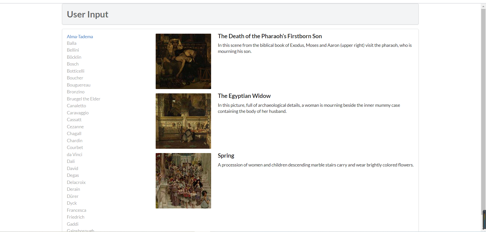
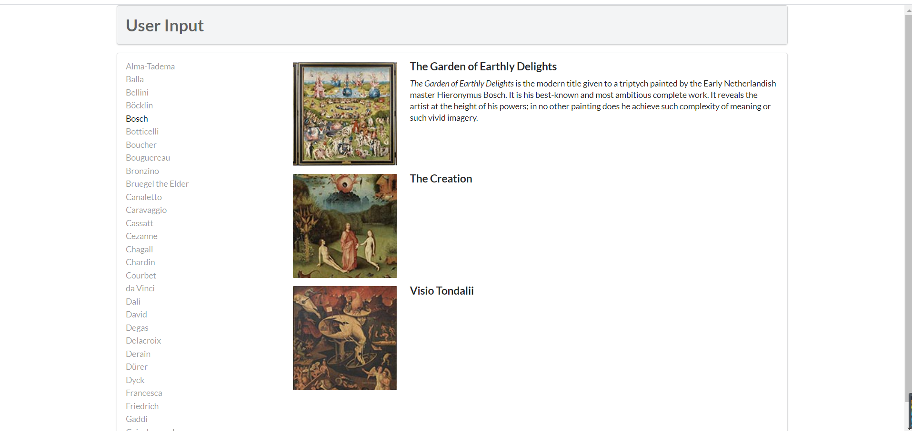
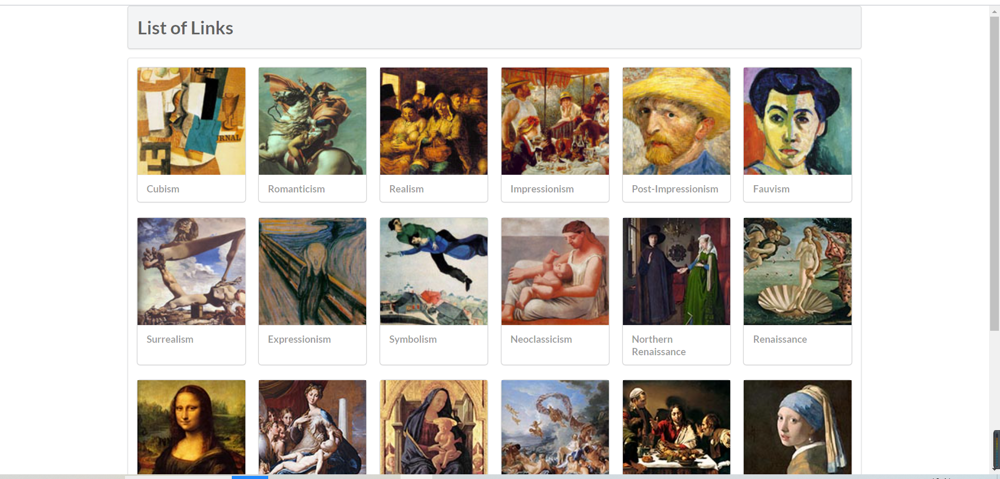

## 解释文档

1.`lab10-exercise7-pdo.php`使用`PDO`连接`MySQL`数据库，首先通过创建`PDO`基类的实例创建连接，`query()`用于有记录结果返回的操作，执行`sql`命令并返回结果，`$row = $result->fetch()`循环输出首行。
  
`lab10-exercise7-mysqli.php`使用`mysqli`（面向对象）连接`MySQL`数据库。`mysqli_connect()`连接数据库，`mysqli_query()`通过`sql`命令获取查询内容，`mysqli_fetch_assoc()`从结果集中取得一行作为关联数组。`mysqli_free_result()`释放结果集占用的内存；`mysqli_close()`关闭数据库连接。
  

2.`lab10-exercise8.php`:

`function outputArtists()`:连接数据库，执行`sql`命令得到结果，判断`$_DET[id]`是否存在、与`$row['ArtistID']`的关系，为真则输出地址为服务器主机名+`？id`+ `$row['ArtistID']`的链接，输出链接名称为`$row['LastName']`，最后显示艺术家链接列表。

 `function outputPaintings()`：显示ID查询字符串中指定的艺术家ID的绘画列表,使用`PDO`连接`MySQL`数据库，并将结果集作为参数传给`function outputSinglePainting($row)`。
 
` function outputSinglePainting($row)`：接收参数，显示对应目录下的图片。
   
 
 3.`lab10-exercise9.php`:与`exercise8`比较，`function outputPaintings()`使用了预处理语句，检查绑定好时的变量，保护程序；使用预处理语句使`MySQL`只会解析一次，具有可观的性能优势。
   
 
4.连接数据库，执行`sql` 命令得到结果集，`function outputSingleGenre($row)`输出图片，并调用`function constructGenreLink($id, $label)`输出文字链接。
  
 