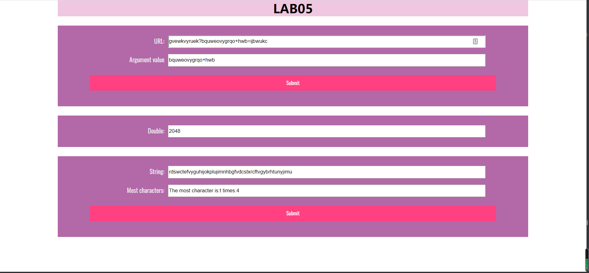
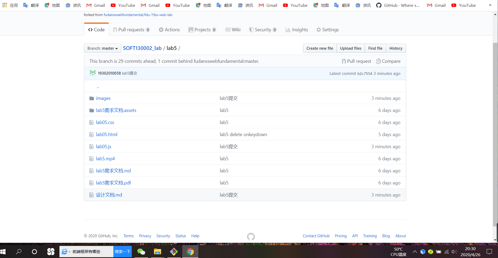

# Lab5设计文档

1.通过`indexOf()`找出`?`与`=`在所在字符串中的位置，再用`slice()`将他从字符串中截取下来。

2.首先先**时间处理**，选择`type:load`,因为是间歇运行函数，
所以选用`setInterval()`,通过时间的`getSeconds()`获取当前的时间秒数，
并且结合运行次数小于10；用`if`分三种情况判断。

3.读取出字符串的长度，创建一个与其长度相等的一维数组，全部赋值为1，用循环实现最后一个字符分别与其前面的每个字符比较，若相等，则对应的前面的那个字符对应的数组
元素`+1`，然后倒数第二个字符也是如此，依次类推，最后通过`Math.max.apply()`找出数组中的最大值
即为某字符出现最多的次数，再用一次循环找到该数字在数组中的位置，即为出现次数最多的字符
在字符串中的位置，最后用`charAt()`将其取出来，与所给条件拼接成字符串。

### 截图

