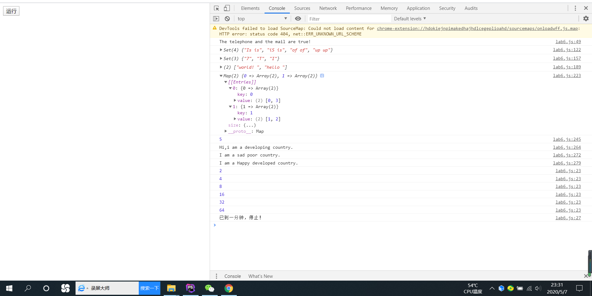

# 设计文档

### 1.各个正则表达式的解释：

`/^[1][345789][0-9]{9}$/`:`/^`起始；`[345789]`匹配3或4或5或7或8或9；`[0-9]`匹配0-9任意一个数字；`{9}`重复9次；`$/`结尾。

`/^[A-Za-z0-9\u4e00-\u9fa5]+@[a-zA-Z0-9_-]+(\.[a-zA-Z0-9_-]+)+$/`:`/^`起始；`[A-Za-z0-9_\u4e00-\u9fa5]`匹配大小写字母、汉字、数字、下划线；`[a-zA-Z0-9_-]`匹配大小写字母、数字、下划线、横线；因为域名可以表示为**xx.xx.xx.xx**,即为`(\.[a-zA-Z0-9_-]+)+`；`$/`结尾；`@`匹配@。

`var re1 = new RegExp(word1[f], "i");`创建一个正则表达式的实例，用以匹配`word[f]`,且不区分大小写；

### 2.对不同继承方式的理解：

（1）借用构造函数：使用`call()`或者`apply()`方法，将父对象的构造函数绑定在子对象上，子类继承了父类的公有属性，父类的原型方法不会被继承，使用`new`来调用构造函数；`this`指代对象的实例；

（2）原型链：通过创建父类型的实例赋给子类型构造函数的原型，重写了原型链对象，子类的对象可以访问到父类以及父类构造函数的prototype中的属性。

（3）Object.create:创建一个新对象，使用现有的对象提供新创建对象的`__proto__`。

### 3.Map、Set、Array之间的区别与使用：

Array:传统数组（下标访问）。

Map:一组键值对的结构，具有极快的查找速度，通过传入数组的数组来建立，key唯一，同key后覆盖前，通过key来得到对应的value。

Set:一组key的集合，但是不存储value,key不重复，通过提供一个Array输入来创建或者通过创建一个空的Set，重复元素在Set中自动被过滤。

### 4.截图：
